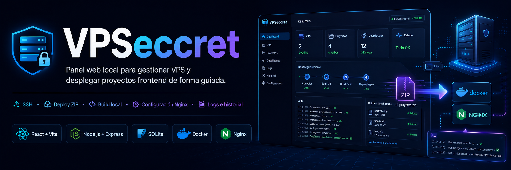
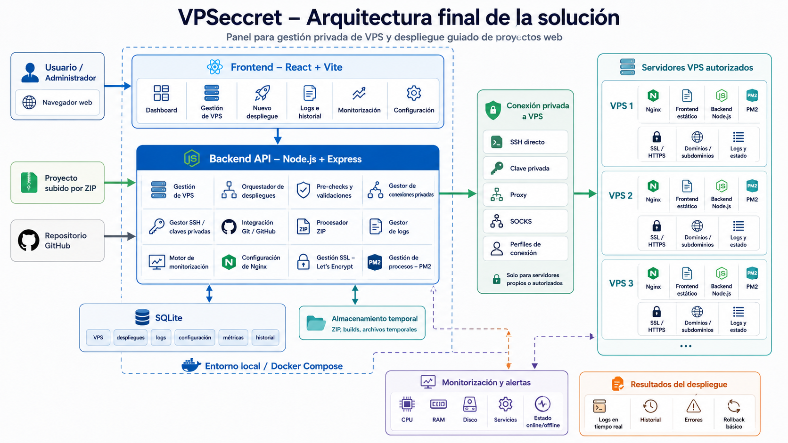

# VPSeccret

**VPSeccret** es una plataforma web en desarrollo para gestionar servidores VPS autorizados y desplegar proyectos web de forma guiada, privada y automatizada.

El objetivo del proyecto es crear un panel visual que permita administrar VPS, probar conexiones SSH, desplegar aplicaciones frontend y backend, configurar Nginx, activar SSL, consultar logs, revisar historial de despliegues y monitorizar el estado de los servidores.

> Proyecto actualmente en desarrollo.

---

## 🚀 Objetivo del proyecto

Desplegar una aplicación en una VPS suele requerir repetir muchos pasos manuales:

- Conectarse por SSH.
- Crear carpetas en el servidor.
- Instalar dependencias.
- Ejecutar builds.
- Configurar Nginx.
- Preparar dominios y subdominios.
- Activar SSL.
- Revisar logs.
- Mantener procesos backend activos.
- Controlar errores durante el despliegue.

**VPSeccret** busca centralizar todo este proceso en una herramienta visual, clara y segura.

La idea es que una persona pueda gestionar sus propios servidores VPS y desplegar proyectos sin tener que recordar todos los comandos o configurar todo manualmente cada vez.

---

## 🧩 ¿Qué permitirá hacer VPSeccret?

La solución final estará pensada para incluir:

- Gestión de varias VPS autorizadas.
- Prueba de conexión SSH.
- Conexión privada a VPS.
- Autenticación mediante usuario/contraseña o clave privada.
- Perfiles de conexión por servidor.
- Soporte para conexión mediante proxy o SOCKS en entornos autorizados.
- Despliegue de proyectos frontend.
- Despliegue desde archivo ZIP.
- Despliegue desde repositorio GitHub.
- Soporte para React, Vue, Angular y HTML/CSS/JS estático.
- Build automatizado.
- Configuración automática de Nginx.
- Gestión de dominios y subdominios.
- Activación de SSL con Let’s Encrypt.
- Despliegue de backends Node.js.
- Gestión de procesos con PM2.
- Gestión de variables de entorno.
- Logs en tiempo real.
- Historial de despliegues.
- Rollback básico.
- Monitorización de CPU, RAM, disco y servicios.
- Dashboard visual con estado de servidores.

---

## 🛠️ Tecnologías principales

### Frontend

- React
- Vite
- CSS / UI personalizada

El frontend será el panel visual desde el que se podrá gestionar todo el flujo del proyecto:

- Dashboard.
- Gestión de VPS.
- Nuevo despliegue.
- Logs.
- Historial.
- Monitorización.
- Configuración.

### Backend

- Node.js
- Express

El backend será el núcleo de la aplicación. Se encargará de:

- Gestionar la API.
- Registrar VPS.
- Procesar archivos ZIP.
- Clonar repositorios GitHub.
- Ejecutar builds.
- Conectarse a servidores por SSH.
- Configurar Nginx.
- Activar SSL.
- Gestionar procesos backend.
- Guardar logs.
- Ejecutar validaciones previas.

### Base de datos

- SQLite

SQLite se utilizará para almacenar:

- Servidores VPS.
- Despliegues.
- Logs.
- Configuración.
- Métricas.
- Historial.

### Infraestructura y despliegue

- Docker
- Docker Compose
- SSH
- Nginx
- Let’s Encrypt
- PM2
- Git / GitHub

---

## 🧱 Arquitectura prevista

El proyecto estará organizado en varias capas:

